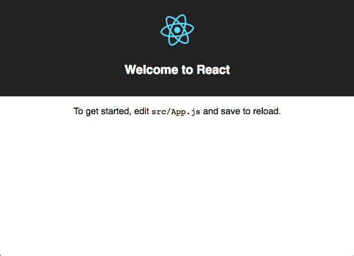
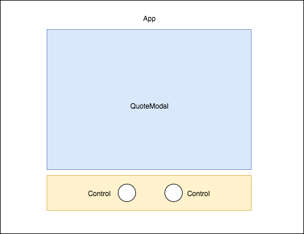
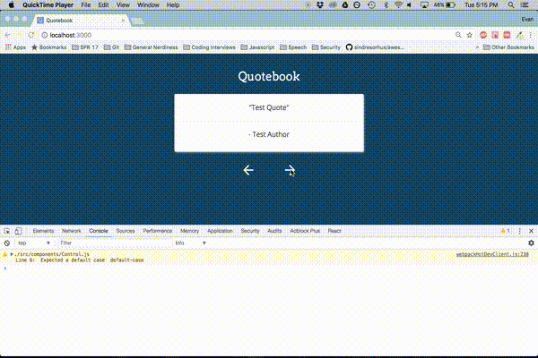

In this tutorial we'll learn how to create an animated quotebook. Check out a live demo of the application here: [randomquotebook.surge.sh](http://www.randomquotebook.surge.sh).

## Road Map

1. Understand and use [create-react-app](https://github.com/facebookincubator/create-react-app) as a boilerplate.
2. Create a function to shuffle the array of available quotes each time the application refreshes.
3. Create "Next" and "Back" buttons to allow users to navigate through the quotes.
4. Add transition animations using [react-css-transition-replace](http://marnusw.github.io/react-css-transition-replace/).
5. Build and deploy the app using [surge.sh](http://surge.sh/).

### Getting Started with create-react-app

This tutorial assumes a working knowledge of [Node.js](https://nodejs.org/en/) and [npm](https://www.npmjs.com/). Check out Alexandru Vladutu's [Step-by-Step Node.js tutorial](https://www.airpair.com/javascript/node-js-tutorial) if you are unfamiliar.

Once you have Node and npm installed, we're ready to get started.

Facebook's [create-react-app](https://github.com/facebookincubator/create-react-app) boilerplate project is a convenient way to start new React SPA projects. It takes care of a lot of the grunt work that comes with setting up a React app. Read more about it [here](https://facebook.github.io/react/blog/2016/07/22/create-apps-with-no-configuration.html) if you are interested.

Now from the command line, install the create-react-app npm package globally:

```
npm install -g create-react-app
```

Now, in a directory of your choosing, create a new app:

```
create-react-app quotebook
```

This might take a minute or two to complete. After it completes, cd into the new project and save [immutable](https://www.npmjs.com/package/immutable) and [react-css-transition-replace](https://www.npmjs.com/package/react-css-transition-replace), two npm packages we'll use later:

```
cd quotebook-tutorial
npm i --save immutable react-css-transition-replace
```

After those finish installing, you can start up the app by running:

```
npm start
```

This will start a development server at localhost:3000. Open up your browser and check it out. It should look like this.



<br>

Explore the create-react-app project structure a little bit. The most important files to note are:

- **src/App.js**: what you actually make edits to.
- **src/index.js**: handles the call to ReactDOM to render the entire <App /> in the "root" div.
- **public/index.html**: the html page onto which the app is rendered.

### Add Bootstrap and Google Fonts

In the head of ```public/index.html``` add the following lines:

```
<link rel="stylesheet" href="https://maxcdn.bootstrapcdn.com/bootstrap/3.3.7/css/bootstrap.min.css" integrity="sha384-BVYiiSIFeK1dGmJRAkycuHAHRg32OmUcww7on3RYdg4Va+PmSTsz/K68vbdEjh4u" crossorigin="anonymous">
<link href="https://fonts.googleapis.com/css?family=Arvo:400,700|Open+Sans" rel="stylesheet">
```

These additions allow use of Bootstrap CSS styles and Google Font's [Arvo](https://fonts.google.com/specimen/Arvo) and [Open Sans](https://fonts.google.com/specimen/Open+Sans).

### Component Level Design

No matter how simple the project, it's always helpful to look at a component-level design of the application.



Nothing too surprising here. Aside from the App-level component, we'll only need two additional components: QuoteModal and Control.

### Create the QuoteModal Component

The QuoteModal component will handle display each quote and author with proper styling.

Within the ```src``` folder of the project, create a new directory called ```components```, and within that directory, create two new files, ```QuoteModal.js``` and ```styles.css```. Now within the ```QuoteModal.js``` file add the following code:

```
import React, { Component } from 'react'
import './styles.css'

class QuoteModal extends Component {

  render(){
    return(
      <div className="text-center quote-modal">
        <p className="quote-text">"{this.props.quote}"</p>
          <hr/>
        <p>- {this.props.author}</p>
      </div>
    )
  }
}

export default QuoteModal
```

And within the ```styles.css``` file add the following code:

```
.quote-modal {
  font-family: 'Open Sans', sans-serif;
  font-size: 16px;
  padding: 20px;
  border-radius: 3px;
  margin: auto;
  width: 95%;
  height: auto;
  background-color: #fff;
  box-shadow:2px 2px 5px #9E9E9E;
}

.quote-text {
  line-height: 1.5;
}

@media only screen and (min-width: 768px){
  .quote-modal {
      width: 500px;
      font-size: 18px;
  }
}
```

Let's understand what's going on in the code above. First, in the ```QuoteModal.js``` file:

- Importing the default export from ```'react'``` under the name ```React```, and we're importing the **named** export ```Component``` under the same name. See [this StackOverflow post](https://stackoverflow.com/questions/31096597/using-brackets-with-javascript-import-syntax) for more on import syntax.

- Importing our newly created stylesheet ```styles.css```.

- Declare the QuoteModal component using an [ES6 class](https://developer.mozilla.org/en/docs/Web/JavaScript/Reference/Classes), and define it's ```render()``` method, the only method required to implement a valid React component. Within the render method, the ```quote``` and ```author``` props are styled appropriately in paragraph tags, and the entire thing is wrapped in a div.

- Export the QuoteModal class so it can be used within the ```App.js``` file later.

Now within the ```styles.css``` file:

- Define the QuoteModal CSS class, which is mobile-optimized. The media query handles checking if the user is on a desktop or tablet, in which case we provide a static width of 500px for the modal and increase the font size.

### Create the Control Component

The Control component will allow us to create our "Back" and "Next" controls. [This article](https://dmfrancisco.github.io/react-icons/) provides a simple, straightforward way to implement icons using inline SVGs; the code below is a simplified version of their example Icon component. Bonus: the article also provides a ton of icons for free use! We'll be using the "arrow-back" and "arrow-forward" SVGs.

Within the ```components``` folder, create a file called ```Control.js``` and add the following code:

```
import React, { Component } from 'react';

class Control extends Component {

  renderGraphic(){
    switch(this.props.icon){
      case 'arrow-back':
        return (
          <g><path d="M20 11h-12.17l5.59-5.59-1.42-1.41-8 8 8 8 1.41-1.41-5.58-5.59h12.17v-2z"></path></g>
        )
      case 'arrow-forward':
        return (
          <g><path d="M12 4l-1.41 1.41 5.58 5.59h-12.17v2h12.17l-5.58 5.59 1.41 1.41 8-8z"></path></g>
        )
    }
  }

  render(){

    const sx = {
      fill: '#FFF',
    }

    return(
    <svg
      onClick={this.props.onClickFunction}
      style={sx}
      width={this.props.width}
      height={this.props.height}
      viewBox="0 0 24 24">
      {this.renderGraphic()}
    </svg>
    )
  }
}

export default Control
```

Again, let's make sure we understand what's going on above:

The```renderGraphic()```method decides which SVG to dispay, based on the "icon" prop passed in to the component. Since our application only has two potential icons, "arrow-back" and "arrow-forward", we only define cases for those.

The ```render()``` method returns an styled svg element. The width, height and onClick function are passed to the component as props and are used here. Note: you could add additional styles to the ```sx``` object if you so choose.

### Use the Components within App.js

Time to strip the boilerplate code out of ```App.js``` and add in the newly created QuoteModal and Control components.

Within ```App.js``` add the following code:

```
import React, { Component } from 'react'

import QuoteModal from './components/QuoteModal'
import Control from './components/Control'

import './App.css'

class App extends Component {

  constructor(props){
    super(props)
    this.state = {
    }
  }

  render() {
    return (
      <div className="App">
        <div className="App-header">
          <h2>Quotebook</h2>
        </div>

        <QuoteModal
          key={1}
          quote={"Test Quote"}
          author={"Test Author"}
        />

        <div className="control-section">
          <div className="control-container">
            <Control
              className="inline-control"
              width={"40"}
              height={"40"}
              icon={"arrow-back"}
              onClickFunction={() => {
                console.log("back button clicked")}}
              />
          </div>
          <div className="control-container">
            <Control
              className="inline-control"
              width={"40"}
              height={"40"}
              icon={"arrow-forward"}
              onClickFunction={() => {
                console.log("next button clicked")}}
              />
          </div>
        </div>
      </div>
    );
  }
}

export default App;

```

And within ```App.css``` add the following classes:

```
body {
  height: 100%;
  background-color: #124563;
}

.App {
  text-align: center;
  display: block;
  overflow: auto;
  height: 100vh;
}

.App-header {
  font-family: 'Arvo', serif;
  height: 100px;
  padding: 20px;
  color: #fff;
}

.control-section {
  text-align: center;
  padding: 20px;
  margin: auto;
  display: block;
}

.control-container {
  display: inline-block;
  border-radius: 58%;
  padding: 5px;
  margin: 0px 30px 0px 30px;
  transition: background-color 0.5s ease-in;
}

.control-container:active {
  background-color: #fff;
}
```

Save both files, and check out the app on localhost. It should look similar to this:



<br>

Understanding the additions to ```App.js```:

Import our QuoteModal and Control components. Definition of the ```constructor()``` function, which we'll use later. Definition of the ```render()``` method. The QuoteModal component takes two example strings in as props. Below that, the controls section. Two Control components are defined here, the first for the Back button and the second for the Next button (as specified by their ```icon``` props). Each Control has a dummy function passed in for the ```onClickFunction``` prop, which just logs the click to the console.

### Add Real Quotes

With the components working correctly, it's time to introduce real quotes. Two options here.

1. Use the quotes file I've created, available on the [Github repo for this project](https://github.com/e-nichols/quotebook/blob/master/src/quotes.js).
2. Create your own quotes.js file, making sure to match the format shown in the linked file above.

Whichever you choose, save the resulting ```quotes.js``` file in the ```src``` directory. And add the following lines to the top of ```App.js```:

```
import { List } from 'immutable'
import quotes from './quotes'
```

And now we'll update the ```constructor``` function with the following code:

```
  constructor(props){

    super(props)

    const the_quotes = List(quotes)
    const init = the_quotes.get(0)

    this.state = {
      quote: init.quote,
      author: init.author,
      available_quotes: the_quotes,
      index: 0
    }
  }

```

I've opted to use [Immutable.js](https://facebook.github.io/immutable-js/) here to create a [List](https://facebook.github.io/immutable-js/docs/#/List) from the array of quotes. Is it *really* necessary to use immutable data structures here? Not really. But the List structure is easy and convenient to use and I've wanted to check out this project for a while. Check out [this talk](https://www.youtube.com/watch?v=I7IdS-PbEgI) if you want to learn more about immutable data.

Beyond that, we are defining state variables for the App-level component. The first quote from the List is used to populate the ```quote``` and ```author``` variables. The ```the_quotes``` variable is assigned to ```available_quotes``` and we initialize the ```index``` variable to 0, which will be used within the onClickFunctions for the controls.

Update the code for the QuoteModal within the ```render()``` function to make use of the newly defined ```quote``` and ```author``` variables:

```
...
    <QuoteModal key={1} quote={this.state.quote} author={this.state.author} />
...
```

Save the changes to ```App.js``` and check out the browser, it should be displaying this quote:


<br>

### Create onClick functions for Back and Next Controls
Users should be able to use the Back and Next controls to navigate through the collection of quotes. To accomplish this, the ```index``` variable defined earlier comes into play.

Let's think about how we would use ```index``` to implement the next and back buttons. A naive implementation to start, which includes a helper function ```performUpdate()```:

```javascript
  performUpdate(){
    const nq = this.state.available_quotes.get(this.state.index)
    this.setState({
      quote: nq.quote,
      author: nq.author,
    })
  }

  handleBackButton(){
      this.setState({
        index: this.state.index - 1
      }, this.performUpdate)
  }

  handleNextButton(){
      this.setState({
        index: this.state.index + 1
      }, this.performUpdate)
  }
```

What's going on here? We've defined two handler functions, ```handleBackButton``` and ```handleNextButton``` which makes a call to React component method ```setState```, decrementing and incrementing the index variable, respectively. And then we provide the ```performUpdate``` method as a callback to be executed *after* this update to the ```index``` variable goes through.

The reasoning for this is laid out in the [React Docs](https://facebook.github.io/react/docs/react-component.html#setstate):

> "Think of ```setState()``` as a request rather than an immediate command to update the component. For better perceived performance, React may delay it, and then update several components in a single pass. React does not guarantee that the state changes are applied immediately.

> ```setState()``` does not always immediately update the component. It may batch or defer the update until later. This makes reading ```this.state``` right after calling ```setState()``` a potential pitfall. Instead, use ```componentDidUpdate``` or a ```setState``` callback (```setState(updater, callback)```), either of which are guaranteed to fire after the update has been applied. If you need to set the state based on the previous state, read about the updater argument below."

Using the callback parameter works well here because ```performUpdate``` is dependent on the index either incrementing or decrementing in order to load a new quote and author.

What if a user immediately hits the back button after launching the page? Won't that decrement the counter to -1? *Yes it will. That's OK though, because [Immutable.js List indices may be negative](https://facebook.github.io/immutable-js/docs/#/List/get). Therefore we can support this interaction by default.

That makes sense... but there's still a problem. Say you only had 5 quotes total. And a user immediately starts hitting the back button, -1, -2, -3, -4, -5... -6? Shit! Trying to ```get(-6)``` on a list of size 5 will break the app. We need to guard against this, and reset the counter upon reaching the absolute value of the size of the quotes array being used. Make a few small additions to the ```increment``` and ```decrement``` functions:

```javascript
  handleBackButton(){
    if(this.state.index === -(this.state.available_quotes.size - 1)){
        this.setState({
          index: 0
        }, this.performUpdate)
    } else {
        this.setState({
          index: this.state.index - 1
        }, this.performUpdate)
    }
  }

  handleNextButton(){
    if(this.state.index === (this.state.available_quotes.size - 1)){
        this.setState({
          index: 0
        }, this.performUpdate)
    } else {
        this.setState({
          index: this.state.index + 1
        }, this.performUpdate)
    }
  }

```

Nice. The if statements turn our List into a circular list, and we'll never have to worry about an invalid indice being generated by the user.

### The Shuffle Function
It's boring to see the same order of quotes each time. Let's fix this by adding an in-place shuffle function to the constructor. A [quick search on StackOverflow](https://stackoverflow.com/questions/2450954/how-to-randomize-shuffle-a-javascript-array) tells us that the Fisher-Yates shuffle is a good candidate for this. Check out this [awesome post and visualization of the algorithm](https://bost.ocks.org/mike/shuffle/) if you want to learn more. Within ```App.js```, add the following function:

```
  shuffleQuotes(arr){
    let curIndex = arr.length, tempVal, randIndex

    while(0 !== curIndex){
      //pick remaining element
      randIndex = Math.floor(Math.random() * curIndex)
      curIndex -= 1

      //swap with current
      tempVal = arr[curIndex]
      arr[curIndex] = arr[randIndex]
      arr[randIndex] = tempVal
    }

    return arr
  }
```

And now, modify the ```constructor``` to make use of the new shuffle function:

```javascript
  constructor(props){
    super(props)

    //randomize order of quotes at start of session
    const shuffled = List(this.shuffleQuotes(quotes))
    const init = shuffled.get(0)

    this.state = {
      quote: init.quote,
      author: init.author,
      available_quotes: shuffled,
      index: 0
    }
  }
```

Great! Refresh the app and click around to test it out. The quotes will shuffle each time the user refreshes the app.

### Selecting Random Background Color
Let's make things a little more visually appealing by having the background color change each time a new quote loads.

Within the ```src``` folder create a new file ```colors.js``` and within it add the following code:

```javascript
module.exports = [ '#703030', '#2F343B', '#7E827A', '#E3CDA4', '#C77966' ]
```

The colors above are from the [Vintage Ralph Lauren Color Theme](https://color.adobe.com/Vintage-Ralph-Lauren-color-theme-2216979/?showPublished=true) on Adobe Kuler. You can find another theme there if you want, or just choose random colors. Add as many as you like. Alternative method: create a function that generates a random hex color string and use that within the render method of the App. Note that you'll probably have to guard against generating white/off-white colors because the Back and Next buttons won't be visible.

Within ```App.js```, import the new ```colors.js``` file:

```
import colors from './colors'
```

Modify the constructor function one more time:

```javascript
  constructor(props){
    super(props)

    const shuffled = List(this.shuffleQuotes(quotes))
    const init = shuffled.get(0)

    const bgcolors = List(colors)

    this.state = {
      quote: init.quote,
      author: init.author,
      available_quotes: shuffled,
      colors: bgcolors,
      index: 0
    }
  }
```

Add a helper function to select a random color from the array:

```javascript
  getRandomColor(){
    let ind = Math.floor(Math.random() * this.state.colors.size)
    return this.state.colors.get(ind)
  }
```

And last, make use of this new function in the ```render``` method:

```javascript
render() {

    const bgcolor = this.getRandomColor()
    const container_style  = {
      backgroundColor: bgcolor,
      transition: 'background-color 1s ease'
    }

    return (
      <div className="App" style={container_style}>
        <div className="App-header">
          <h2 className="animated fadeIn">Quotebook</h2>
        </div>
        ...
```

Refresh the app and click around to see the new background colors in action. The transition CSS attribute comes in handy here, allowing for smoother transitions between background colors.

### Adding Animations
Let's animate the transition between quotes in a similar way to how the background color transitions. If only there was an open source component that animates replacing one element with another... like [react-css-transition-replace](https://github.com/marnusw/react-css-transition-replace)!. As its README notes, there are some nice advantages to using this component:

- It automatically handles the positioning of the animated components, and
- allows changes in the height of container to be handled and animated with ease when various content heights differ, even when absolute positioning is used.

That really comes in handy here because of the variable length of each quote. Let's add it in. We already took care of installing the react-css-transition-replace npm package at the start of the project; import into ```App.js``` now:


We'll use the cross-fade transition as shown in the first example on the README. Add the following styles to ```App.css```:

```
.cross-fade-leave {
  opacity: 1;
}

.cross-fade-leave.cross-fade-leave-active {
  opacity: 0;
  transition: opacity 1s ease-in;
}

.cross-fade-enter {
  opacity: 0;
}

.cross-fade-enter.cross-fade-enter-active {
  opacity: 1;
  transition: opacity 1s ease-in;
}

.cross-fade-height {
  transition: height 1s ease-in-out;
}
```

And now let's use the component within App.js. Import it:

```javascript
import ReactCSSTransitionReplace from 'react-css-transition-replace'
```

And modify the ```render``` method to use it:

```javascript
  render() {

    const bgcolor = this.getRandomColor()
    const container_style  = {
      backgroundColor: bgcolor,
      transition: 'background-color 1s ease'
    }

    return (
      <div className="App" style={container_style}>
        <div className="App-header">
          <h2 className="animated fadeIn">Quotebook</h2>
        </div>

        <ReactCSSTransitionReplace transitionName="cross-fade" transitionEnterTimeout={1500} transitionLeaveTimeout={1500} >
          <QuoteModal key={this.state.quote} quote={this.state.quote} author={this.state.author} />
        </ReactCSSTransitionReplace>

        <div className="control-section">
          <div className="control-container">
            <Control width={"40"} height={"40"} icon={"arrow-back"} onClickFunction={this.handleBackButton.bind(this)} className="inline-control" />
          </div>
          <div className="control-container">
            <Control width={"40"} height={"40"} icon={"arrow-forward"} onClickFunction={this.handleNextButton.bind(this)} className="inline-control" />
          </div>
        </div>
      </div>
    );
  }
```

Refresh the app and try out the new animation.

### Reviewing App.js
Boom! You're done. Here is the ```App.js``` file in its final form:

```javascript
import React, { Component } from 'react'
import ReactCSSTransitionReplace from 'react-css-transition-replace'
import { List } from 'immutable'

import QuoteModal from './components/QuoteModal'
import Control from './components/Control'

import './App.css'

import quotes from './quotes'
import colors from './colors'

class App extends Component {

  constructor(props){
    super(props)

    const shuffled = List(this.shuffleQuotes(quotes))
    const init = shuffled.get(0)

    const bgcolors = List(colors)

    this.state = {
      quote: init.quote,
      author: init.author,
      available_quotes: shuffled,
      colors: bgcolors,
      index: 0
    }
  }

  // https://stackoverflow.com/questions/2450954/how-to-randomize-shuffle-a-javascript-array
  shuffleQuotes(arr){
    let curIndex = arr.length, tempVal, randIndex

    while(0 !== curIndex){
      //pick remaining element
      randIndex = Math.floor(Math.random() * curIndex)
      curIndex -= 1

      //swap with current
      tempVal = arr[curIndex]
      arr[curIndex] = arr[randIndex]
      arr[randIndex] = tempVal
    }

    return arr
  }

  getRandomColor(){
    let ind = Math.floor(Math.random() * this.state.colors.size)
    return this.state.colors.get(ind)
  }

  performUpdate(){
    const nq = this.state.available_quotes.get(this.state.index)
    this.setState({
      quote: nq.quote,
      author: nq.author,
    })
  }

  handleBackButton(){
    // guard against users who start scrolling backwards immediately
    // and miraculously make it all the way through to the end of the array
    if(this.state.index === -(this.state.available_quotes.size - 1)){
        this.setState({
          index: 0
        }, this.performUpdate)
    } else {
        this.setState({
          index: this.state.index - 1
        }, this.performUpdate)
    }
  }

  handleNextButton(){
    // guard against reaching end of quotes array and having to "wrap back around"
    if(this.state.index === (this.state.available_quotes.size - 1)){
        this.setState({
          index: 0
        }, this.performUpdate)
    } else {
        this.setState({
          index: this.state.index + 1
        }, this.performUpdate)
    }
  }

  render() {

    const bgcolor = this.getRandomColor()
    const container_style  = {
      backgroundColor: bgcolor,
      transition: 'background-color 1s ease'
    }

    return (
      <div className="App" style={container_style}>
        <div className="App-header">
          <h2 className="animated fadeIn">Quotebook</h2>
        </div>

        <ReactCSSTransitionReplace transitionName="cross-fade" transitionEnterTimeout={1500} transitionLeaveTimeout={1500} >
          <QuoteModal key={this.state.quote} quote={this.state.quote} author={this.state.author} />
        </ReactCSSTransitionReplace>

        <div className="control-section">
          <div className="control-container">
            <Control width={"40"} height={"40"} icon={"arrow-back"} onClickFunction={this.handleBackButton.bind(this)} className="inline-control" />
          </div>
          <div className="control-container">
            <Control width={"40"} height={"40"} icon={"arrow-forward"} onClickFunction={this.handleNextButton.bind(this)} className="inline-control" />
          </div>
        </div>
      </div>
    );
  }
}

export default App;
```

### Prepare to Deploy
Let's build the app for production. This is super easy. From the command line, in the base directory of the project, run:

```
npm run build
```

Simple as that. After the build completes you should see a message like this in your terminal:

```
evannichols:_Dev/quotebook ‹master*›$ npm run build

> quotebook@0.1.0 build /Users/evannichols/_Dev/quotebook
> react-scripts build

Creating an optimized production build...
Compiled with warnings.

./src/components/Control.js
  Line 6:  Expected a default case  default-case

Search for the keywords to learn more about each warning.
To ignore, add // eslint-disable-next-line to the line before.

File sizes after gzip:

  75.73 KB  build/static/js/main.e46c105f.js
  524 B     build/static/css/main.37e0d7c2.css

The project was built assuming it is hosted at ./.
You can control this with the homepage field in your package.json.

The build folder is ready to be deployed.
```

### Deploy using Surge
It's time to share your quotebook with the world! If you want. [Surge](http://surge.sh/) is a ruthlessly simple way to deploy static apps/websites. First, install the surge npm package globally:

```
npm install -g surge
```

If you would like to use a custom domain name (like mycoolquotebook.surge.sh or supercoolquotes.surge.sh) you'll need to add a CNAME into your ```build``` folder. Note that the domain must end in ```.surge.sh```. If you don't care about the domain name you can skip this step; surge will automatically generate a random name for you. From the command line, cd into the ```build``` folder and run:

```
echo <YourCustomDomainName>.surge.sh > CNAME
```

Now, in the base directory of your project run:

```
surge
```

This will then prompt you to specify your project path. Since we want to deploy the ```build``` folder, make sure to add that to the project path. Finally, hit enter, and let surge do the rest! It should look something like this:

```
evannichols:_Dev/quotebook ‹master*›$ surge

    Surge - surge.sh

              email: evantnichols@gmail.com
              token: *****************
       project path: /Users/evannichols/_Dev/quotebook/build
               size: 10 files, 2.4 MB
             domain: randomquotebook.surge.sh
             upload: [====================] 100%, eta: 0.0s
   propagate on CDN: [====================] 100%
               plan: Free
              users: evantnichols@gmail.com
         IP Address: 45.55.110.124

    Success! Project is published and running at <YourCustomDomainName>.surge.sh
```

Go check out your quotebook live!

**Update (7/11/17)**: It is possible to automate the deployment process by editing the ```deploy``` script in the project's ```package.json``` file:

```
    "deploy": "echo <YourCustomDomainName>.surge.sh > build/CNAME && surge build"
```

---

I hope you enjoyed this tutorial. If you have any questions or comments, shoot me an email at evantnichols@gmail.com.
