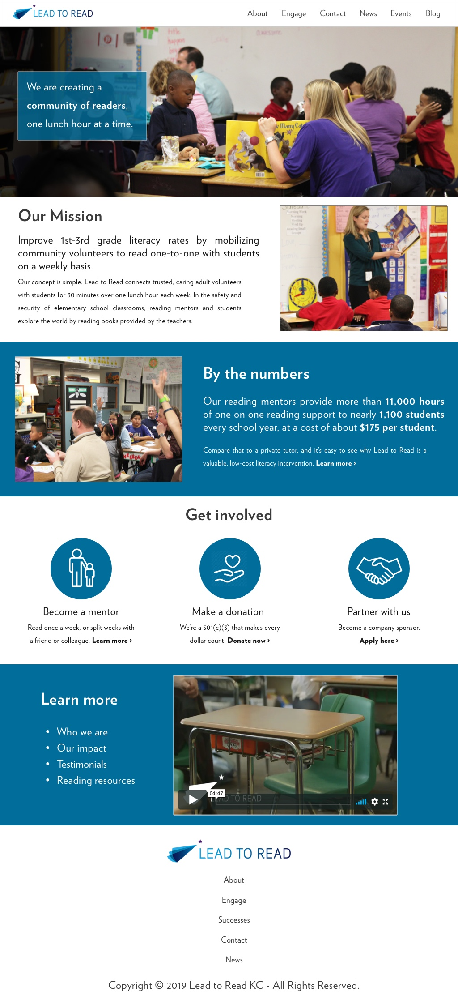

Lead to Read KC is a non-profit which facilitates reading-based mentorship in the Kansas City metro area. They connect adult volunteers with 1st-3rd grade students for one hour each week to read together. As their motto goes, "Together we are creating a community of readers, one lunch hour at a time."

Lead to Read's previous website was a 10+ year old Wordpress site with lackluster [Lighthouse](https://developers.google.com/web/tools/lighthouse) audit scores:


The performance and accessibility categories are especially concerning: the site isn't accessible or mobile friendly, and takes over 17 seconds to become interactive.

I approached Pauly Hart, executive director of Lead to Read and a longtime family friend, last year to propose a website redesign using [Gatsby](https://www.gatsbyjs.com/). Gatsby is a fantastic React/GraphQL-powered static site generator that I've [written about before](https://etnichols.com/programming/blog-redesign-with-gatsby). She gave the redesign the green light and off we went!

This post discusses my experience using Gatsby for the redesign while continuing to use Wordpress as the underlying content management system (CMS).

## Getting Started

I kept some "north star" goals in mind during the redesign:

- Performance: improve the Lighthouse audit scores.
- Accessibility: make sure the site works for _everyone_.
- Responsiveness: a layout that works on any screen size.
- Digestable: clear messaging and easy-to-discover content.

To get started, I combed the existing site and tried to group the existing content into more logically-grouped sections, and then used Sketch to bring the pen-and-paper sketches a little more color:



After a couple iterations with Martha and Pauly, we settled on the landing page layout and the content of the navigation menu.

## Building out the new site

- The Good
- templates for the blog posts and content pages
- plugins for mailchimp forms
- awesome developer experience with new experimental wordpress plugin
- Firebase deploy integration
- typescript support

- The Bad
- hardcoding front page data

- The Ugly
- Critical integration broken during migration (fast support response though)

### Hardcoded vs Dynamic pages

The contents of the site can be split into two buckets of React components:
- Hardcoded components (e.g. image carousel, "Our Reach" infographic)
- Dynamically generated components (e.g. blog posts, "What's New" section)

Why hardcode data at all? Let's look at a specific example: the "How it Works" section is a simple three-step graphic with some custom icons. Here's the code:

```js
import React from 'react'

import Icon from './icon'

import './howitworks.scss'

// Icon name, CSS class, description tuples
const PAGE_DATA = [
  [
    'school',
    'purple-background',
    `Identify schools and students in need of reading support and mentoring.`,
  ],
  [
    'recruit',
    'orange-background',
    `Recruit, train and pair Reading Mentors with students in grades K-3.`,
  ],
  [
    'book',
    'bright-blue-background',
    `Provide students with 30 minutes of one-to-one reading support and mentoring one lunch hour each week.`,
  ],
]

const HowItWorks = () => (
  <section>
    <div className="content">
      <h1 className="headline">How It Works</h1>
      <ol className="how-it-works-list">
        {PAGE_DATA.map(([iconName, className, description], i) => (
          <li key={`hiw-${i}`}>
            <div className={`circular-icon margin-medium ${className}`}>
              <Icon name={iconName} />
            </div>
            <div className="margin-top-small">
              <span className="bold">{i + 1}. </span>
              {description}
            </div>
          </li>
        ))}
      </ol>
    </div>
  </section>
)

export default HowItWorks
```

It's pretty straightforward, using a array of data to keep things DRY. The alternative option here would be to store the data in Wordpress as a single page (or three separate pages?), query them all, and then place the raw HTML content into the data array.

That might look like:

```
TODO(etnichols): fill me in
```

That approach seemed brittle and overly complicated (what if the HTML from Wordpress is malformed, accidentally multi-paragraph? What if someone accidentally deletes or renames one of those pages?). It's always a trade-off: given this copy is relatively stable, I chose to simply hardcode.

That same logic applies to the image carousel and the "Our Reach" infographic: hardcoded data to accommodate non-standard layouts.

- Custom React components with hard-coded copy
  - The image carousel and the "Our reach" are hardcoded (not ideal, requires manual update)
  - Could've gotten more creative on how to source this data dynamically (a hidden post, Advanced Custom Fields, etc) but given the low-frequency updates required, did not pursue this.
- Dynamically-sourced content via `gatsby-source-wordpress-experimental`
  - experimental plugin allows for live updates
  - used in tandem with WPGraphQL, WPGatsby (https://github.com/gatsbyjs/gatsby-source-wordpress-experimental/blob/master/docs/getting-started.md)
- Some helpful plugins

## Discussion

- Gatsby sites feel like a snowflake -- a core GatsbyJS bundle where actual functionality falls onto a large ecosystem of plugins. Beneficial that they all follow a common configuration style (gatsby-config.js) but... the more complicated the site, the more plugins you have to wrangle. It can be overwhelming.
- What about Next.js? https://jaredpalmer.com/gatsby-vs-nextjs
