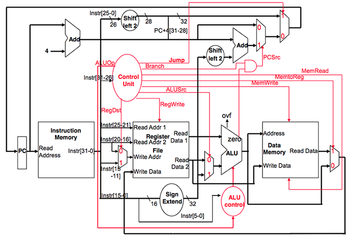

I designed and implemented a MIPS Single Cycle CPU as the final project for my Computer Architecture class at KU, EECS 645. The CPU is comprised of 17 separate components, which we developed individually throughout the semester. The CPU takes in 32-bit instructions, and can be tested using a workbench in Vivado.



Using MARS, a MIPS Assembler and Runtime simulator, I converted the following assembly program into 32-bit instructions that the CPU could recognize. The output was placed into the instruction memory component.

```
    addi $t0, $zero, 5
    addi $t1, $zero, 7
    start:	sw	$t0,  0($sp)
    sw	$t1, -4($sp)
    lw	$s0,  0($sp)
    lw	$s1, -4($sp)
    beq	$s0, $s1, Else
    add	$s3, $s0, $s1
    j	Exit
    Else:	sub	$s3, $s0, $s1
    Exit:	add	$s0, $s0, $s3
    or	$s1, $s1, $s3
    addi	$t0, $t0,  3
    addi	$t1, $t1,  3
    addi	$sp, $sp, -8
    j	start
```
I confirmed the CPU was working correctly by comparing its final register values to that of the MARS simulator after running the assembly program.

The CPU does not support recurisve functions because I did not implement the Jump And Link (JAL) MIPS instructions,

As a CS student, I rarely venture this deep into the EE/CoE side of the spectrum. This project was a great exercise in learning the basics of CPU architecture. Understanding how programs are compiled and interpreted by the CPU as MIPS instructions provided a great complement to the work I do in higher-level programming languages. There is a certain "completeness" I feel now understanding how, say, a C program is transformed into object code and executed by a CPU. With that said, I think I'll stick to the high-level languages.

Check out the code for this project **[here](https://github.com/e-nichols/EECS_645/tree/master/MIPS_Single_Cycle_CPU)**.
