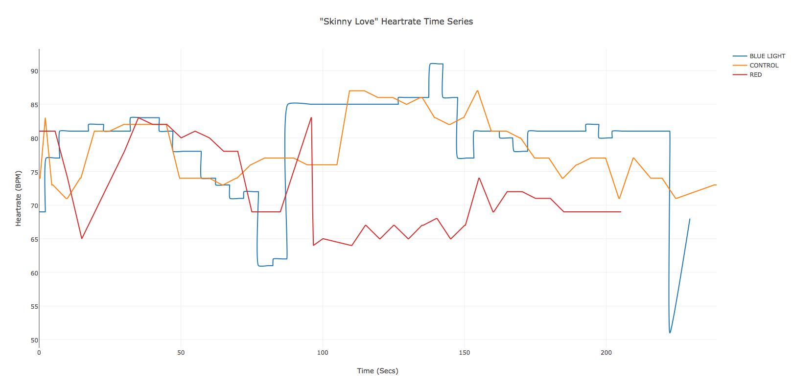
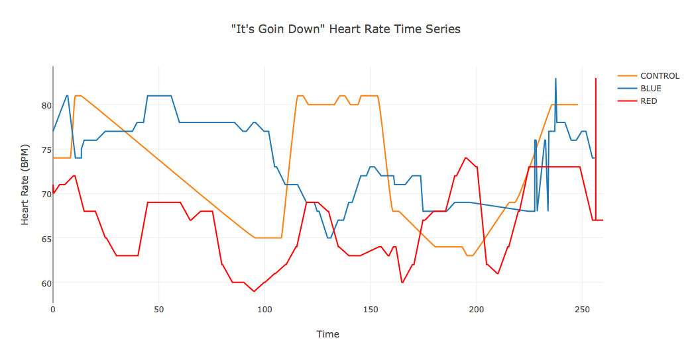

### Introduction

Americans spend an average of 4 hours and 5 minutes listening to music each day. [6] Music can have both positive and negative effects on the human body and mind. Athletes listen to pump-up music to prepare for games. Yoga instructors play Kirtan or Tibetan chants to enhance the focus of their participants. Music therapy programs seek to address physical, emotional, cognitive, and social needs of individuals. Different sounds provide different sensations to a human listener.

The same type of effects can be said for light: soft candle lighting sets an intimate, relaxing environment, while the harsh fluorescent lighting of a classroom at 8:00 a.m. can be a rude awak- ening for bleary-eyed students. Red lighting puts us in a heightened state of alertness or awareness, while blue tends to relax us.

We experience these two mediums so constantly that our physiological reactions to their stim- ulus are very much subconscious. Our project, LED Soundsystem, will gauge user’s physiological response to different music and light combinations. In particular, we will analyze different light- ing environments and their effects on listener’s heart rate. These findings will be paired with key acoustic attributes of each song – danceability, energy and valance – to see which attribute has the most impact on changes in heart rate. Additionally, the system will runs the above tests under three separate lighting environments to measure how much it affects physiological response as well.

### Problem Statement

Many people use music as a means of escape from stress or to alter their mood. Numerous studies, some of which are mentioned below, address this behavior and its effectiveness. However, very few address the influence of other environmental factors that could affect results substantially. LED Soundsystem provides a tool to test the influence of one of these environmental factors: lighting. By measuring physiological influence of combining music and different shades of light, LEDSoundSystem generates meaningful data that can be analyzed. Conclusions drawn from this analysis lead to assertions of correlation between light, music and physiological response. Our application will be able to identify which music and light combinations provide positive reactions, and which ones do not. This increased awareness could potentially improve the overall well-being of users. On a broader scale, aggregated data from this application could be incredibly valuable to Music Therapy researchers seeking to find the most therapeutic combinations of music and light.

### System Design

The final system design consists of 4 primary components: the iOS application, the Apple Watch application, the NodeJS/Express Raspberry Pi Server, and the Phillips HueTM LED lights. Each component and its purpose are described briefly below.

##### iOS Application

The iOS Application handles authenticating the user’s Spotify account (to allow access to their API) and allows users to select a song for which to take heart rate measurements. The app utilizes Apple’s HealthKit framework to query the heart rate sensors embedded in the Apple Watch. After the user selects a song, the app takes measurable song data provided by the Spotify API, attaches the measured heart rate (queried every five seconds) and makes a POST call to a RESTful API built with Node.JS on the Pi.

##### Apple Watch Application

The Apple Watch application’s only purpose is to accept the ”begin workout” request from the iOS app and stream heart rate data to the phone while the song plays.

##### Raspberry Pi NodeJS/Express Server

The server handles storing data from the iOS app and creating output graphs for the heart rate and song attributes. It uses an array to store song information, and an array within each song to keep track of heart rate as data points are received via POST calls. When a song is complete, the information is formatted and sent to Plotly to generate graphs depicting heart rate vs. time and acoustic attributes vs. percentage change in heart rate. These graphs show us which part of the songs and acoustic attributes have the greatest physiological effects.

##### Phillips HueTM LED Lights

The lights constitute our final experimental variable. They are implemented using the ZigBee communication protocol. They are controlled using a Dresden Elektronik RaspBee module. This hat has a Zigbee module and antenna built directly into it and connects to the Pi?s GPIO pins. Using a modified version of Raspian, an operating system designed for the Pi, the lights can be controlled using a laptop connected to the Pi?s broadcasted WiFi or through an Ethernet cable. With this system, there is more versatility for installation, as being able to install this system when there are multiple wired and wireless networks that aren?t interconnected is nearly impossible.

### Results and Analysis

We gathered heart rate data using a playlist of 8 songs from Spotify, across a variety of acoustic attributes. We ran our tests using three different lighting environments: a control environment of plain white light, a strong red, and a cool blue. With all other factors held constant, this allowed us to gauge how much lights effect heart rate. The light color is taken into account in the Plotly graphs. Timestamped measurements were sent to and stored on the server. These measurements were then cleaned, removing all ”jumpy” data and misreads (i.e. any measurement showing a +/- 20 BPM drop within a span of 1-3 seconds was thrown out, as these would be characteristic of a heart attack, not a reaction to song or light). Graphs for the heart rate data across the three lighting environments were then created using Plot.ly. Time series plots of Bon Iver’s ”Skinny Love,” and Big Gigantic’s ”It’s Goin’ Down” are below.

We aggregated data from all 24 tests using R and Microsoft Excel. We examined initial, maximum, and average heart rates, as well as the max differential, all illustrated in the table below.

The control lighting produced both the highest average heart rate, as well as the highest differ- ential of +10 BPM. This disproved our initial hypothesis of the red lighting producing the highest average heart rate and differential. In fact, the red lighting environment produced the lowest average heart rate across the three tests seven out of eight times, by an average margin of -5.4 BPM.

It is worth noting some possible sources of errors in our measurements. As mentioned before, the Apple Watch has a tendency to send very inaccurate readings near the beginning and end of the sessions. While most of these instances were cleaned before graphing, there were a few readings in the middle of measurement sessions that displayed huge drops in heart rate. The test subject’s physiological response may have been less noticeable after the second and third exposure to the same song, even with different lighting environments. Lastly, there was little done in terms of mental and physical preparation before each tests, i.e. we did not try to have the test subject begin with the same resting heart rate at the beginning of each test.

### Related Work

A UC Berkeley study revealed that connections between music and color was strongly influenced by emotion. [5] Participants were asked to match 18 different selections of classical music to a color. Faster music in a major mode was consistently matched with lighter, yellower color choices while slower music in a minor mode produced darker, more saturated blue colors. Participants from both the United States and Mexico were included in the study to take into account potential ”cultural dependencies;” however, the patterns and color choices were consistent across both cultures.

Listening to classical and relaxing music after exposure to stressors can reduce anger and anxiety, and stimulate the sympathetic nervous system. [4] Similarly, light has distinct effects on mood and emotional response. Ambient brightness triggers the intensity of human’s affective response, while reducing lights can reduce the emotionality of everyday decisions. [2]

A 1998 research paper from the Alternative Therapies journal studied the impacts that different music genres have upon tension and mood within listeners. Different age groups were tested using four different music genres: grunge rock, classical, new age, and designer. Mood indicators were measured before and after listening to the different genres. The study observed that every genre did affect mood in varying intensities [3].

Other research shows links between ambient brightness and humans’ affective response. Bright sunny days have both positive and negative effects: they can fill the heart with joy, but they are also associated with heartbreak. [1] Similarly, sunny days cause depression-prone people to become more depressed. Suicides peak in late spring and summer, and reach their lowest point during the winter months. Bright light tends to amplify a person’s initial emotional response, whether that be positive or negative. [2]

### Notes on Development

Cole handled the bulk iOS and Apple Watch application, I did the Express server and data analysis, Ian handled controlling the lights via a Raspberry Pi.

I got my feet wet with this [helpful tutorial](http://blog.modulus.io/nodejs-and-express-create-rest-api), and further modified it to suit my needs. The server needed to handle initial song POST request, followed by heartrate data POSTs specific to that song.

I utilized [Postman](https://www.getpostman.com/) to test the server -- super easy to learn and quite helpful.

Link to our [Github Repo](https://github.com/LEDSoundsystem).

### References
1. S. Kevan. [Perspectives on season of suicide: A review.](http://www.sciencedirect.com/science/article/pii/0160800280900052) Social Science & Medicine, 14(4):369– 378, dec 1980.
2. A. Jing Xu A. Labroo. Incandescent affect: [Turning on the hot emotional system with bright light.](http://www.sciencedirect.com/science/article/pii/S1057740813001174) Journal of Consumer Psychology, 24(2):207–216, apr 2007.
3. Rollin McCraty. [Effects of different types of music on mood, tension and mental clarity.](http://www.hartfocus.nl/UserFiles/Image/Music_Mood_Effects.pdf) Alter- native Therapies, 4:75–84, 1998.
4. E. Labbe N. Schmidt J. Babin M. Pharr. [Coping with stress: the effectiveness of different types of music.](http://link.springer.com/article/10.1007/s10484-007-9043-9#/page-1) Applied Psychophysiology and Biofeedback, 32(3):132–168, dec 2007.
5. S. Palmer K. Schloss Z. Xu L. Prado-Leon. [Music and Color associations are mediated by emotion.](http://www.pnas.org/content/110/22/8836) Proceedings of the National Academy of Sciences of the United States of America, 110(22):8836– 8841, may 2013.
6. Edison Research. [Share of ear: Americans’ share of time spent listening to audio sources](http://www.edisonresearch.com/edison-research-conducts-first-ever-share-of-ear-measurement-for-all-forms-of-online-and-offline-audio/), jun 2014.

<i>Completely unrelated to LED Soundsystem: I did a really cool lighting talk for this class regarding the potential security flaws found in the Zigbee protocol. Presentation slides are available [here](https://docs.google.com/presentation/d/1LUWWX5FCqcx3Q958lidHzCkJW_FE08mY49uE6NfL3oQ/edit?usp=sharing), along with the [original paper off which I based the talk](https://www.blackhat.com/docs/us-15/materials/us-15-Zillner-ZigBee-Exploited-The-Good-The-Bad-And-The-Ugly-wp.pdf).
</i>
